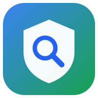

<div align="center">



# vibesafe

**Real security scans — right inside your AI coding agent.**


Secrets · dependencies · SAST · IaC/containers · licenses — **one normalized report. Local engines.**

</div>

---

## Why vibesafe?

A pure-prose security guide can only *advise* — it never actually checks anything. vibesafe is the
alternative: a **skill that runs real scanners** and feeds normalized, prioritized findings back to
your agent — then helps you fix them, only with your approval.

It works two ways at once: it **guides** secure patterns while you write code, and **audits** on
demand with gitleaks, semgrep, trivy, and the npm/pip/osv advisory databases — every result merged
into a single severity-ranked report.

## Highlights

- 🔑 **Secrets, for real** — gitleaks + trivy, with **redacted** values and a `committed` flag that
  calls out secrets already in git history
- 📦 **Vulnerable dependencies** — `npm audit` · `pip-audit` · `osv-scanner` across ecosystems
- 🐛 **Code (SAST)** — semgrep security rulesets (injection, XSS, `eval`, weak crypto, …)
- 🐳 **IaC & containers** — trivy for Docker/Terraform misconfig + license risks
- 🧩 **One report** — every scanner normalized into a single ranked `report.json` / `report.md`
- 🪶 **Zero-dependency core** — the orchestrator is Python **stdlib only**; missing tools degrade gracefully
- 🔒 **Local-first** — scan engines run on your machine; only dependency *names* ever hit advisory APIs
- ⚙️ **Two installs** — a Claude Code plugin, or a plain clone into any agent's skills directory

## Requirements

- **Python 3.8+** — the orchestrator (`scripts/scan.py`) is **stdlib-only**, no `pip install` needed.
- **Optional scanners** for full coverage (see [Scanners](#scanners)). Without them vibesafe still
  runs whatever is available and shows the coverage gaps in the report.

## Install

### Claude Code — as a plugin (recommended)

```text
/plugin marketplace add marco-scheffler/vibesafe
/plugin install vibesafe@vibesafe-marketplace
```

### Claude Code — as a cloned skill

```bash
git clone https://github.com/marco-scheffler/vibesafe.git ~/.claude/skills/vibesafe
```

### Other agents

Same idea — clone into the agent's skills directory (global), or the project-local
`.<agent>/skills/` for a single project:

| Agent | Global skills directory |
|---|---|
| Claude Code | `~/.claude/skills/vibesafe` |
| Cursor | `~/.cursor/skills/vibesafe` |
| Codex | `~/.agents/skills/vibesafe` |
| GitHub Copilot | `~/.copilot/skills/vibesafe` |
| Antigravity (Gemini) | `~/.gemini/antigravity/skills/vibesafe` |

Either way, restart your agent, then just ask: *“scan &lt;project&gt; for security issues.”*

## Scanners

The orchestrator runs each tool if available (installed binary, or ephemeral `uvx`/`pipx run`
for Python tools), otherwise it skips it with an install hint. One-time full setup:

```bash
brew install gitleaks trivy osv-scanner   # native binaries
pip install pip-audit                      # usually already present
# semgrep needs no install — vibesafe runs it via `uvx`
```

| Category | Tool | Install |
|---|---|---|
| Secrets | gitleaks | `brew install gitleaks` |
| Dependencies | npm audit / pip-audit / osv-scanner | built-in / `pip install pip-audit` / `brew install osv-scanner` |
| Code (SAST) | semgrep | `uvx semgrep` (auto) / `brew install semgrep` |
| IaC / Container / License | trivy (fallback: checkov) | `brew install trivy` |

## Usage

- **Guidance** triggers automatically when you write or modify web-app code.
- **Audit on demand** — ask the agent (*“scan this project”*), or run the scanner directly:

```bash
python3 ~/.claude/skills/vibesafe/scripts/scan.py <path>
```

It writes `report.json` + `report.md` to a temp dir and prints the path. Useful flags:
`--only secrets,deps,sast,iac,license` · `--timeout <seconds>` · `--out-dir <dir>`.

## Automate it (CI / pre-commit)

vibesafe is CI- and pre-commit-friendly. Exit codes are **opt-in** — a plain run always exits `0`;
`--fail-on <sev>` turns findings into a build gate.

**GitHub Action** — the repo ships a composite action (install the engines you want; missing ones
degrade gracefully):

```yaml
- uses: marco-scheffler/vibesafe@v1.6.0
  with:
    path: .
    fail-on: high
```

**pre-commit** (`.pre-commit-config.yaml`) — scans **staged** changes, fails on `high`+:

```yaml
repos:
  - repo: https://github.com/marco-scheffler/vibesafe
    rev: v1.6.0
    hooks:
      - id: vibesafe
```

**Existing codebases** — freeze current findings with `--update-baseline`, then `--baseline
vibesafe-baseline.json` shows only *new* issues; suppress accepted ones via `.vibesafeignore`; scope
fast scans to changed files with `--staged` / `--diff <ref>`. Full reference:
[`references/automation.md`](references/automation.md).

## How it works & privacy

The scan engines run **locally** — your **source code is not uploaded**. Dependency scanners send
only **package names + versions** to advisory APIs (npm registry, PyPI, OSV); semgrep downloads
rulesets and trivy downloads a vulnerability DB (cached locally). No paid feed, no AI service.
Full details and the data-source matrix: [`references/tools.md`](references/tools.md).

Secret findings never contain the raw secret value (redacted by design), and carry a `committed`
flag — `true` means the secret is in a git-tracked file (in history → rotate **and** purge).

## Docs

- Secure-coding guidance: [`references/secure-coding.md`](references/secure-coding.md)
- Design spec: [`docs/specs/2026-06-13-vibesafe-skill-design.md`](docs/specs/2026-06-13-vibesafe-skill-design.md)
- Implementation plan: [`docs/plans/2026-06-13-vibesafe.md`](docs/plans/2026-06-13-vibesafe.md)

## Tests

```bash
bash tests/run-tests.sh
```

## License

MIT — see [`LICENSE`](LICENSE). Inspired by the open-source
[VibeSec-Skill](https://github.com/BehiSecc/VibeSec-Skill) (Apache-2.0); all content here is original.
